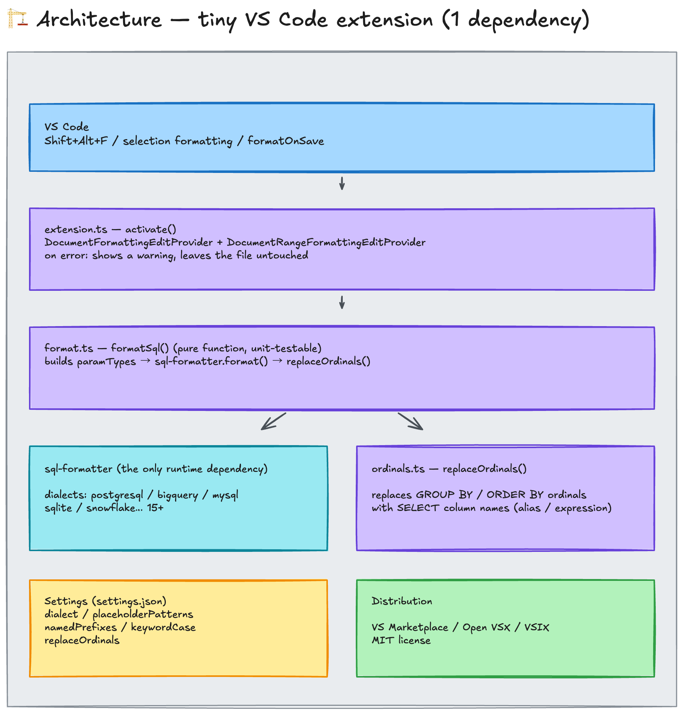

# SQL Template Formatter

[](https://marketplace.visualstudio.com/items?itemName=HidenobuNagai.sql-template-formatter)
[](https://marketplace.visualstudio.com/items?itemName=HidenobuNagai.sql-template-formatter)
[](https://open-vsx.org/extension/HidenobuNagai/sql-template-formatter)

A VS Code extension that formats `.sql` files containing template placeholders (common in Python projects) without breaking them. Existing SQL formatters treat `${XXX}` as a syntax error; this one does not.
The same formatter also ships as a **CLI** (`npx sql-template-formatter`) for CI, pre-commit, and AI-agent hooks — it calls the identical core, so both produce byte-identical output.

## Features

- Works with `Shift+Alt+F` (Format Document), selection formatting, and `editor.formatOnSave`
- Placeholders are kept intact: `${var}` `{var}` `{{ var }}` `%s` `%(name)s`
- `GROUP BY 1, 2` / `ORDER BY 1` ordinals are replaced with the referenced column names (disable with `sqlTemplateFormatter.replaceOrdinals: false`)
- Dialect selectable: PostgreSQL (default) / BigQuery / MySQL / SQLite / Snowflake and more (all dialects supported by sql-formatter)

## How it works

Existing SQL formatters treat template placeholders (`${var}`, `{{ var }}`, `%s` …) as syntax errors and refuse to format such files. This extension avoids masking entirely: it registers the placeholder patterns with `sql-formatter` v15+ as parameter tokens (`paramTypes.custom`), so the SQL is formatted with the placeholders kept intact.

[](architecture.html)

> 🔍 **[Open Interactive Architecture Diagram](architecture.html)** — Explore components, guided views, and pipeline trace.


## Install

- Visual Studio Marketplace: [HidenobuNagai.sql-template-formatter](https://marketplace.visualstudio.com/items?itemName=HidenobuNagai.sql-template-formatter)
- Open VSX (VSCodium etc.): [HidenobuNagai/sql-template-formatter](https://open-vsx.org/extension/HidenobuNagai/sql-template-formatter)
- From VSIX: run `bun run package`, then in VS Code go to Extensions view → `...` → `Install from VSIX...`

This extension conflicts with other SQL formatter extensions. When using it, set it as the default formatter in settings.json and disable the others:

```json
{
  "[sql]": {
    "editor.defaultFormatter": "HidenobuNagai.sql-template-formatter",
    "editor.formatOnSave": true
  }
}
```

## CLI

Same formatter, no editor required — useful in CI, pre-commit, and AI-agent hooks.

```bash
npx sql-template-formatter query.sql              # file → stdout
npx sql-template-formatter --write query.sql      # rewrite in place
npx sql-template-formatter < query.sql            # stdin → stdout
npx sql-template-formatter --check sql/*.sql      # exit 1 if not formatted (CI)

# pre-commit / agent hook (GNU xargs): format only the .sql files that changed
git diff --name-only --diff-filter=ACM -- '*.sql' | xargs -r sql-template-formatter --write
```

| Option | Description |
|---|---|
| `-w`, `--write` | Rewrite files in place |
| `--check` | Exit 1 if any input is not already formatted |
| `-l`, `--dialect <name>` | SQL dialect (default: `postgresql`) |
| `-k`, `--keyword-case <c>` | `upper` / `lower` / `preserve` (default: `upper`) |
| `--no-ordinals` | Keep `GROUP BY 1` / `ORDER BY 1` as-is |
| `--comma-position <p>` | `after` (default) keeps a wrapping comma at the end of the previous line; `before` moves it to the start of the next line |
| `--keep-functions-inline` | Keep `SUM(...)` / `COUNT(CASE ... END)` on one line instead of breaking their arguments |
| `--tab-width <n>`, `--tabs` | Indentation (default: 2 spaces) |
| `-c`, `--config <file>` | Config JSON (default: the nearest `.sql-formatter.json`) |
| `-h`, `--help`, `--version` | |

The nearest ancestor `.sql-formatter.json` is picked up automatically. It accepts the standard `sql-formatter` keys (`language`, `keywordCase`, `tabWidth`, `useTabs`, `paramTypes.custom`) plus `placeholderPatterns`, `replaceOrdinals`, `commaPosition`, and `keepFunctionsInline`:

```json
{
  "language": "postgresql",
  "keywordCase": "upper",
  "placeholderPatterns": ["\\$\\{[^}]+\\}", "\\{\\{[\\s\\S]*?\\}\\}", "\\{[^{}]*\\}", "%\\([^)]*\\)s", "%s"],
  "replaceOrdinals": true,
  "commaPosition": "after",
  "keepFunctionsInline": false
}
```

When neither `placeholderPatterns` nor `paramTypes.custom` is set, the extension's five default patterns apply, so placeholders survive untouched. The CLI does not read VS Code's `settings.json`; its defaults match the extension's defaults (`postgresql` + `upper` + ordinals replaced).

The file's final newline is **preserved**: a newline-terminated file stays newline-terminated (extra trailing blank lines collapse to one) and a file without one is left alone. `sql-formatter` re-prints the parse tree, so the last newline is restored explicitly — otherwise every run would leave a `\ No newline at end of file` diff behind and `--check` could never pass on a normal file. Line endings are normalized to LF, the same default as Prettier (`endOfLine: "lf"`).

> **Hooks:** prefer formatting at the *end* of an agent turn (`Stop`) rather than right after every file write. Rewriting a file immediately after the agent wrote it invalidates the old text it may still try to edit.

## Settings

| Setting | Default | Description |
|---|---|---|
| `sqlTemplateFormatter.dialect` | `postgresql` | Dialect (postgresql, bigquery, mysql, sqlite, snowflake, etc.) |
| `sqlTemplateFormatter.placeholderPatterns` | Regexes for `${...}`, `{{...}}`, `{...}`, `%(name)s`, `%s` (5 entries) | Array of placeholder regex **strings**. **Earlier patterns take priority** |
| `sqlTemplateFormatter.namedPrefixes` | `[]` | Prefixes for named parameters (e.g. `[":"]`). Compatible with `::` casts |
| `sqlTemplateFormatter.keywordCase` | `upper` | Keyword casing (preserve/upper/lower) |
| `sqlTemplateFormatter.replaceOrdinals` | `true` | Replace `GROUP BY`/`ORDER BY` ordinals (e.g. `1, 2`) with the referenced column names. Ordinals referencing placeholder expressions, aggregates without alias, or `SELECT *` are left untouched |
| `sqlTemplateFormatter.commaPosition` | `after` | `after` keeps a wrapping comma at the end of the previous line; `before` moves it to the start of the next line with no space after it (`id` / `    ,name`), keeping a trailing `-- comment` with its own item |
| `sqlTemplateFormatter.keepFunctionsInline` | `false` | Re-join the formatter's line breaks inside `word(...)` groups so `SUM(...)`, `COUNT(CASE … END)`, and nested calls stay on one line. Newlines inside string literals, `$$…$$` bodies, and comments are never removed |

### Customizing placeholders

```json
{
  "sqlTemplateFormatter.placeholderPatterns": [
    "\\$\\{[^}]+\\}",
    "\\{\\{[\\s\\S]*?\\}\\}",
    "\\{[^{}]*\\}",
    "%\\([^)]*\\)s",
    "%s",
    "@\\w+"
  ],
  "sqlTemplateFormatter.namedPrefixes": [":"]
}
```

## Notes

- The `{...}` pattern can falsely match JSON literals (e.g. `SELECT '{"a":1}'::jsonb;`). Text inside string literals is normally safe because the lexer processes strings first, but remove this pattern if you run into issues.
- Jinja2 control constructs (`` etc.) are not supported.
- Patterns match in array order. Put Jinja2's `{{ }}` before single `{ }` (the defaults already do).
- Patterns are strings, not RegExp objects (settings.json values are always strings anyway).

## Development

```bash
bun install
bun run compile   # tsc build
bun test          # unit tests (bun:test)
node out/cli.js --help   # run the CLI from the build output
bun run package   # build .vsix
```

Press F5 to launch an Extension Development Host for manual testing.

## Release (maintainers)

1. Bump the version in `package.json` and tag it: `git tag vX.Y.Z`
2. Push the tag: `.github/workflows/publish.yml` publishes to the VS Code Marketplace (VSCE), Open VSX (OVSX), and npm.
   npm uses [trusted publishing (OIDC)](https://docs.npmjs.com/trusted-publishers) — no token or repository secret; the trust relationship is registered on the package's npm settings page and must name this workflow file (`publish.yml`). Provenance attestations are attached automatically.
3. Manual alternative:
   - VS Marketplace: run `bun run publish:vsce` with `VSCE_PAT` set
     (the script is deliberately **not** named `publish`: npm runs a `publish` script as a lifecycle step of `npm publish`, so it would fire again on every npm release and fail without `VSCE_PAT`)
   - Open VSX: run `bunx ovsx publish -p $OVSX_PAT` with `OVSX_PAT` set
   - npm: run `npm publish --access public` with `NODE_AUTH_TOKEN` set (or, from CI, rely on trusted publishing)

Never commit PATs in plain text. Manage them with dotenvx or similar.

## License

MIT
